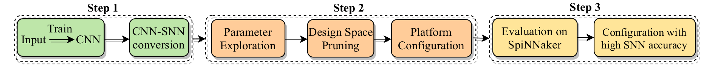

# Spiking Neural Network (SNN) Exploration on Neuromorphic Hardware (SpiNNaker)
This tool extends the SNN conversion toolbox (SNN-TB) and performs efficient exploration of the hardware dependent parameters of the SpiNNaker neuromorphic
platform. The goal is to achieve the highest possible accuracy on the SpiNNaker board for a given SNN architecture.
The overview of our framework is shown below: 

Our framework executes the following steps:

- Step 1: Trains the original Convolutional Neural Network (CNN) and converts it to SNN using the SNN-TB.
- Step 2: Performs design space explorationof platform configurations that affect accuracy on the SpiNNaker neuromorphic board, such as 
neurons per core, spiking input rate, and time scale. It applies a heuristic method to prune the design space and selects the candidate configurations.
- Step 3: Evaluates the candidate solutions on the SpiNNaker and decides the configuration that optimizes the prediction accuracy of the deployed SNN.

## Disclaimer

This work is based on the SNN conversion toolbox (SNN-TB) that transforms a rate-based
artificialgiven neural network that is decribed in a common deep-learning framework (Keras/TF and others) into the equivalent spiking representation
and provides an interface to deploy the SNN on the SpiNNaker board. 

Please refer to the [documentation](http://snntoolbox.readthedocs.io) and the [repository](https://github.com/NeuromorphicProcessorProject/snn_toolbox) for a complete user guide and API reference. See also the accompanying articles
[Rueckauer et al., 2017](https://www.frontiersin.org/articles/10.3389/fnins.2017.00682/abstract)
and [Rueckauer and Liu, 2018](https://ieeexplore.ieee.org/abstract/document/8351295/).

## Prerequisites

To install the SNN-TB please refer to the installation instructions in the github [repository](https://github.com/NeuromorphicProcessorProject/snn_toolbox)
and the guide [here](https://snntoolbox.readthedocs.io/en/latest/guide/installation.html).

## Notes

This framework was developed targeting the SpiNN-5 version of the SpiNNaker architecture. For more information, please refer to the website of the University of Manchester [here](http://apt.cs.manchester.ac.uk/projects/SpiNNaker/) and the corresponding publications.

## Aknowledgement

Do we add anything for the center ?
